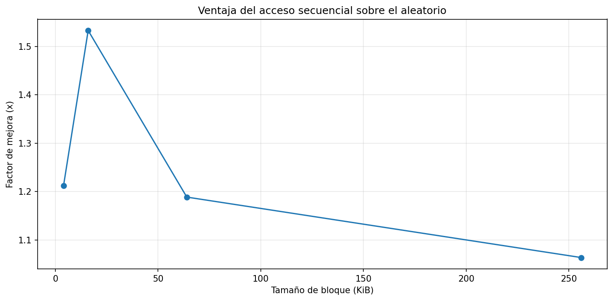
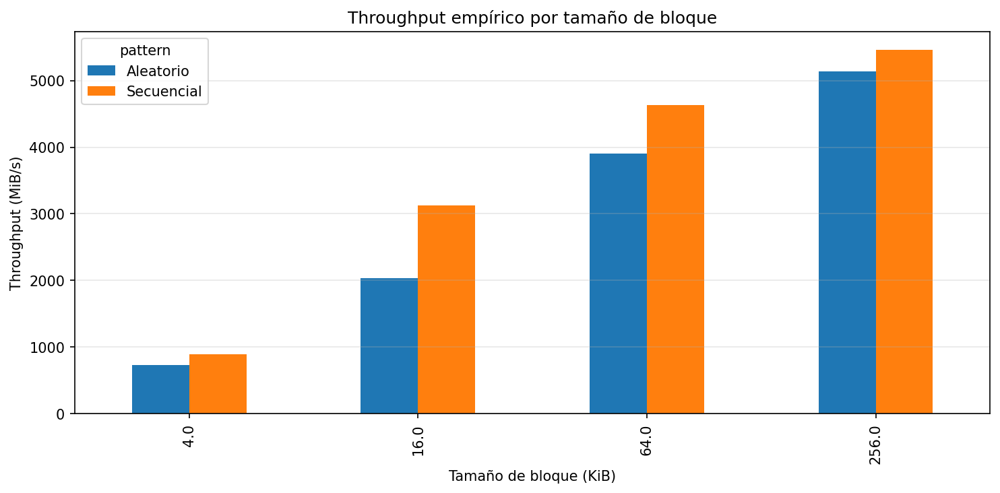
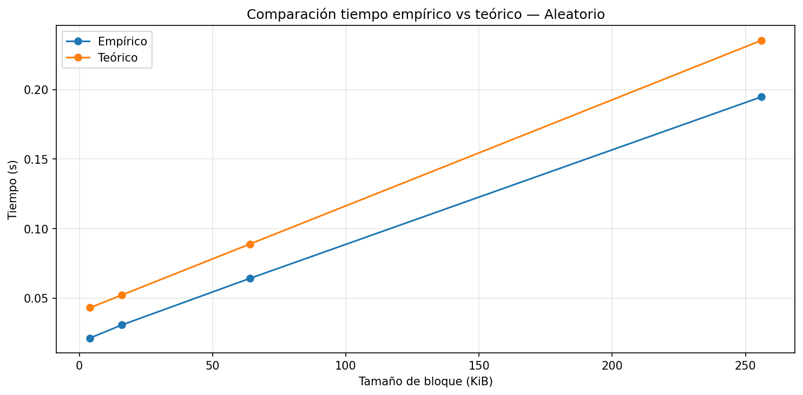
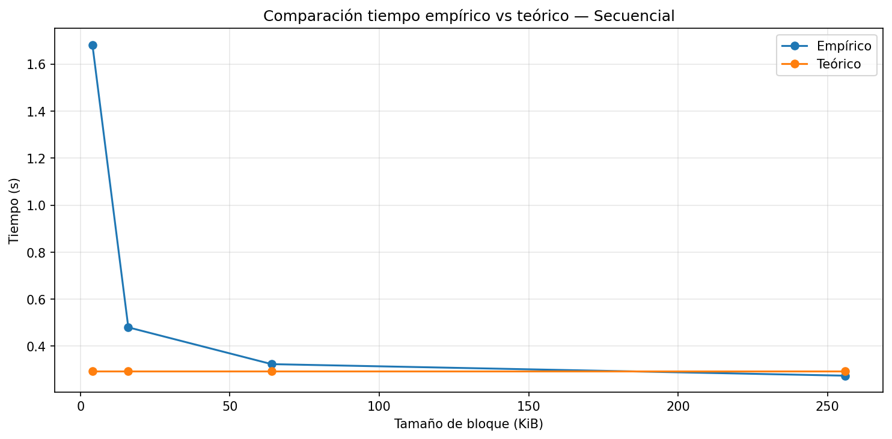
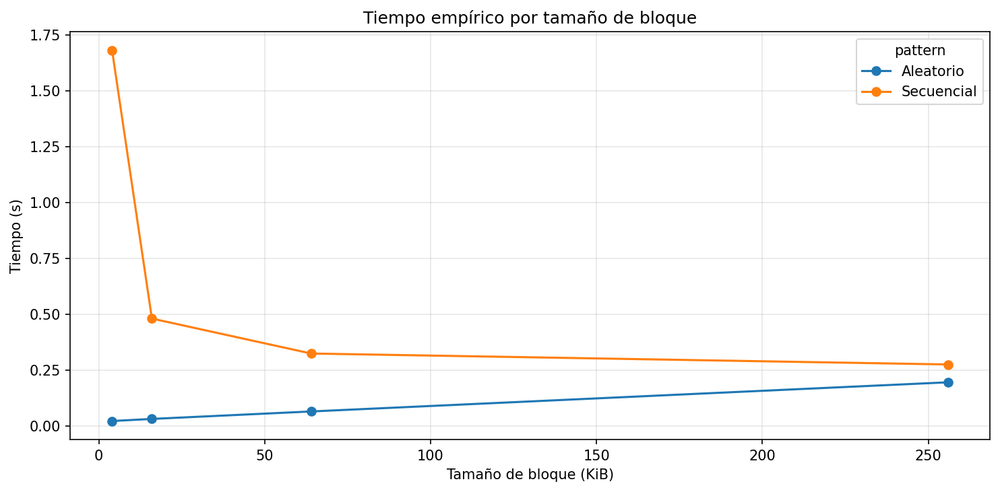

# lab3-IO_performance-JuanFernandoMonaCano
* **Nombre:** Juan Fernando Mona Cano
* **Correo:** juanf.mona@udea.edu.co

---
## Etapa 1 - Caracterización del Equipo

| Parámetro | Valor de Referencia |
| --- | --- |
| **Sistema Operativo** | Windows 11 25H2 |
| **CPU (Modelo y Frecuencia)** | Intel Core i3-1115G4 @ 3.00GHz |
|**Arquitectura y Núcleos**|x64 / 2 Núcleos|
| **Memoria RAM Total** | Ej: 8GB DDR4 |
| **Tecnología de Almacenamiento** | Ej: SSD NVMe |
| **Carga de CPU en Reposo** | <= 3% |

## Etapa 2 - Resultados del experimento
---
**Fig_speedup**

**Fig_throughput**

**Fig_tiempo_teoria_vs_practica_aleatorio**

**Fig_tiempo_teoria_vs_practica_secuencial**

## Etapa 3 - Análisis y conclusiones
---

### Punto de control 1 — Revisión conceptual
**1.** ¿Qué representa la latencia en este laboratorio?
**2.** ¿Qué representa el throughput?
**3.** ¿Por qué en acceso secuencial normalmente se asume que $M \approx 1$?
**4.** ¿Por qué en acceso aleatorio $M$ tiende a ser mayor?

**Respuestas**
- **Respuesta 1:** En nuestro caso, la latencia es entonces el tiempo que tardaría mi máquina personal, en este caso, en acceder al disco duro para la lectura y escritura del archivo que se va a crear más adelante.

- **Respuesta 2:** En nuestro caso, el throughput sería la velocidad que persistirá durante el proceso de acceso y lectura en el disco a través del archivo de pruebas.

- **Respuesta 3:** Esto se debe entonces a que, como M representa los accesos no contiguos en disco, si este fuera mayor, no leería todos los bloques continuamente, sino que podría llegar a saltarse alguno al no poder acceder de uno en uno, por lo que ya no lo consideraríamos como un acceso secuencial.

- **Respuesta 4:** Contrario al anterior, al ser mayor a 1, ese puede acceder a bloques que estén separados entre sí; en este caso depende de M el número de bloques que salta de uno a otro, pudiendo entonces acceder a distintos bloques en menor tiempo, pero sin leerlos todos.

### Punto de control 2 — Reflexión sobre la configuración
**1. Tamaño del archivo:** ¿Es suficiente para superar la caché RAM de su equipo? Compare con los valores de RAM registrados en la Etapa 1 de la guía.

**2. Tamaño de bloque:** Los tamaños evaluados (4 KB, 16 KB, 64 KB, 256 KB) corresponden a tamaños típicos de páginas en sistemas operativos y motores de bases de datos. ¿Cuál esperaría que tuviera mejor rendimiento en acceso aleatorio y por qué?

**3. Entorno de ejecución:** ¿Está ejecutando en local o en Google Colab? Recuerde que en Colab los tiempos medidos corresponden al hardware de Google, no al suyo.

**Respuestas:**
- **Respuesta 1:** El archivo supera el tamaño de la caché inicialmente.

- **Respuesta 2:** Yo, en lo personal, esperaría que tuviera un mejor rendimiento un tamaño de 256, debido a que, al ser un tamaño más grande, el acceso podría tender a ser más separado de un bloque a otro, cubriendo una mayor parte del acceso.

- **Respuesta 3:** El laboratorio está ejecutándose en entorno local (se está utilizando Visual Studio Code).

#### Analice - Creación del archivo
1. ¿Qué papel cumple este archivo dentro del experimento?
2. ¿Por qué es útil trabajar con un archivo relativamente grande?
3. ¿Qué cree que ocurriría si el archivo fuera demasiado pequeño?

> **Criterio mínimo:** la respuesta 3 debe mencionar explícitamente
> el concepto de caché del sistema operativo.

**Respuestas:**

- **Respuesta 1:** En este contexto, el archivo simularía una especie de disco duro con la función de lectura de archivos dentro de sí mismo.

- **Respuesta 2:** Porque al ser un archivo que contiene más registros, podemos simular de mejor manera un entorno cotidiano (un disco duro actual) y así ver reflejado el acceso a disco.

- **Respuesta 3:** Si el archivo fuera demasiado pequeño, probablemente el sistema operativo lo cargue completamente en la caché. Esto haría que los accesos no se realicen realmente al disco, sino a memoria RAM, que es mucho más rápida.

#### Análisis de resultados empíricos

Observe la tabla generada y responda:

1. ¿Cuál patrón de acceso fue más rápido para cada tamaño de bloque?
2. ¿El throughput cambió al aumentar el tamaño de bloque?
3. ¿En qué caso observó la mayor diferencia entre secuencial y aleatorio?

> **Criterio mínimo:** la respuesta 3 debe incluir valores numéricos
> concretos obtenidos de la tabla (throughput en MiB/s o tiempo en s).

**Respuesta:**
* Respondiendo a las preguntas anteriores, tenemos entonces que, por bloque en términos de tiempo, el acceso aleatorio fue el más rápido en todos los casos; por ej., en el caso del bloque de 256.00 KB, que fue el caso con los tiempos más parecidos, con 0.08 s de diferencia, donde el acceso aleatorio fue un poco más rápido en términos de tiempo, pero en términos de rendimiento (throughput) en todo momento fue el acceso secuencial, siendo entonces, por ej., en el bloque de 256.00 KB, su rendimiento de 5463.16 MiB/s, mientras que en el acceso aleatorio fue de 5135.70 MiB/s. Con respecto al throughput, tenemos que fue cambiando de tamaño respecto al bloque anterior; por ej., vemos una diferencia bastante notoria entre el primer bloque (4.00 KB) y el segundo (16.00 KB), siendo entonces de 892.04 MiB/s para el acceso secuencial en el primer bloque y de 3124.37 MiB/s de acceso secuencial en el segundo bloque. Finalmente, tenemos que el caso con mayor diferencia entre patrones de acceso sería cuando el bloque fue de 256.00 kB, al menos en tiempo de throughput, en donde el acceso secuencial tuvo un throughput de 5463.16 MiB/s y el acceso aleatorio un throughput de 3549.57 MiB/s, en comparación, por ejemplo, con su bloque anterior de 64.00 kB, donde el acceso secuencial tuvo un throughput de 4635.65 MiB/s y el acceso aleatorio tuvo un throughput de 3899.70 MiB/s. Comparándolos, vemos que el de 256 kB es ligeramente más lento, ya que sus tiempos varían, siendo más rápido en el bloque de 64.00 kB y más eficiente en comparación al de 64 kB.

### Punto de control 3 — Modelo teórico elegido
#### Análisis comparativo: teoría vs práctica

Interprete la tabla comparativa:

**1.** ¿Los tiempos empíricos son mayores o menores que los teóricos?
**2.** ¿En cuál patrón de acceso la teoría se aproxima mejor?
**3.** ¿Qué factores reales podrían explicar las diferencias?

> **Criterio mínimo:** la respuesta 3 debe mencionar al menos dos
> factores concretos (por ejemplo: caché del SO, temperatura,
> carga del sistema, tipo de disco).

**Respuesta:**
* Los tiempos van variando dependiendo del bloque donde nos ubiquemos en el caso del acceso secuencial. Por ej., al ubicarnos en el bloque de 256 KB, el acceso secuencial empírico tiene un tiempo de 0.274566 s, mientras que el teórico tiene un tiempo de 0.292979 s, que es ligeramente mayor; pero si, por ejemplo, nos ubicamos en el bloque de 64 KB, tenemos que el acceso secuencial empírico tiene un tiempo de 0.323579 s, mientras que en el teórico tenemos un tiempo de 0.292979, que es ligeramente menor. Entonces, mientras más grande sea el bloque, más rápido en términos de tiempo del análisis empírico. Yo diría que el patrón de acceso secuencial en el bloque de 256 KB es el que más se le aproxima, tanto en términos de tiempo como de throughput. Finalmente, hablando de qué factores pueden estar afectando para que los resultados sean diferentes, podría deberse, primero que nada, a la cantidad de caché que reserva la RAM en mi máquina, que va variando bastante; por ejemplo, cuando escribo esto, el caché está en 2,2GB, por lo que ese puede ser un factor notable. Y el otro factor podría ser también la carga de procesos que tenía el sistema cuando realicé las pruebas, ya que no se consumen muchos recursos en reposo; entonces, esto pudo haber hecho que mi máquina haya reservado la mayor parte de recursos cuando se corrió la prueba.

#### Interprete la gráfica de throughput

Describa con sus palabras qué muestra esta gráfica:

- ¿Qué barras son más altas?
- ¿Qué significa eso en términos de rendimiento?
- ¿Cuál patrón aprovecha mejor la lectura en bloques?

> **Criterio mínimo:** mencione al menos un tamaño de bloque específico
> y su valor de throughput observado.

**Respuesta:**
* En todos los casos podemos observar que las barras más altas son las del acceso secuencial; entonces, esto significa que el acceso secuencial es más eficiente que el acceso aleatorio en términos de rendimiento, es decir, que podría buscar una mayor cantidad de información sin usar una cantidad de recursos absurda. Si miramos, por ejemplo, el bloque de 256.00 KB, nos daremos cuenta de que el acceso secuencial tiene un throughput de aproximadamente 5500 MiB/s, mientras que el acceso aleatorio tiene un aproximado de 5100 MiB/s en el mismo bloque, por lo que concluyo que el patrón de acceso secuencial aprovecha mejor la lectura de los bloques debido al mayor rendimiento que presenta durante la gráfica.

#### Interprete la gráfica de tiempo

Explique cómo cambia el tiempo total cuando cambia el tamaño de bloque.

> **Criterio mínimo:** compare el comportamiento de la curva secuencial
> con la aleatorio e indique en qué punto divergen más.

**Respuesta:**
* Si vemos la anterior gráfica, podemos darnos cuenta de que el acceso aleatorio es muy poco variable en cada bloque que pasa respecto al tiempo; por ejemplo, si vemos el bloque de 4.00 kb comparado con el de 16.00kb, es mínima la diferencia en tiempo que hay entre ambos, e igual con el de 64.00kb, y aunque el de 256.00 kb tiene un tiempo ligeramente mayor, no es una diferencia significativa respecto a los anteriores. Lo que sí es que, a medida que crece el bloque, también aumenta el tiempo linealmente. Si lo comparamos con el patrón de acceso secuencial, podemos ver una diferencia bastante considerable a medida que pasan los bloques, ya que casi empezamos desde los 2 segundos en el bloque de 4 kb y luego este se estabiliza desde los 64 kb hasta los 256 kb, pero a diferencia del aleatorio, que es linealmente constante y va aumentando su tiempo, el secuencial es más bien lo contrario y su tiempo va disminuyendo con el tiempo.

#### Interprete la comparación empírico vs teórico

Observe las curvas y responda:

1. ¿Las curvas tienen una tendencia similar?
2. ¿Dónde se separan más?
3. ¿Qué le sugiere eso sobre el modelo usado?

> **Criterio mínimo:** la respuesta 3 debe indicar si el modelo
> sobreestima o subestima el tiempo real, y proponer una razón.

**Respuesta:**
* Solo en el caso del acceso aleatorio las curvas tienen una tendencia similar y unos tiempos aproximadamente similares, pero el caso contrario sería el caso del acceso secuencial, donde el modelo empírico, que al empezar son completamente diferentes en tiempo, aunque a medida que se avanza por los bloques los tiempos tienden a ser similares. En el caso del acceso secuencial, las gráficas se separan más justo al inicio, en el primer bloque, y en el caso del acceso aleatorio, se separan en todo momento y de manera casi constante, pero se separan de una manera un poco más pronunciada en el último bloque. El modelo en general sobreestima el tiempo real, especialmente en el acceso aleatorio, donde los valores de tiempo teóricos son mayores que los empíricos, donde una posible razón podría ser que el modelo no tiene en cuenta efectos como la caché del sistema operativo, que reduce los tiempos reales al evitar accesos directos al disco.

#### Interprete la ventaja del acceso secuencial

La gráfica muestra cuántas veces el acceso secuencial supera al aleatorio.

- ¿Cuál fue el mayor factor de mejora observado?
- ¿Cómo cambia esa ventaja con el tamaño de bloque?
- ¿Qué implicación tiene esto para el diseño de software?

> **Criterio mínimo:** incluya el valor numérico del mayor speedup
> observado y el tamaño de bloque en que ocurrió.

**Respuesta:**
* El mayor factor de mejora que se observa en la gráfica es de $\approx 1.6$ en el bloque de 16, siguiendo entonces una mejora de $\approx 1.2$ en el bloque de 4 kb y luego una mejora de $\approx 1.19$ en el bloque de 64; esta ventaja es variable dependiendo del tamaño del bloque, ya que a partir del bloque de 64 kb el factor de mejora disminuye casi por completo, pero no es 0, por lo que sigue habiendo una mejora del acceso secuencial sobre el aleatorio. Esto implica que, en el diseño de software, es preferible organizar los datos y accesos de forma secuencial, es decir, uno tras otro, ya que ofrece mejor rendimiento que el acceso aleatorio, especialmente con ciertos tamaños de bloque. Además, sugiere que elegir adecuadamente el tamaño de bloque puede influir en el rendimiento, por lo que se deben evitar accesos dispersos y aprovechar la localidad de los datos.

---

## Conclusión:
* La información se almacena en el disco organizándose en bloques, donde el sistema de archivos traduce estos archivos lógicos en direcciones de hardware específicas. Esto es crucial porque el rendimiento depende de la eficiencia con la que el controlador localiza y recupera estos bloques. En el acceso secuencial, el sistema lee los datos de forma contigua, mientras que en el aleatorio debe buscar direcciones dispersas, generando latencia. Incluso en los SSD, aunque no hay piezas móviles, el acceso aleatorio es más lento debido a la sobrecarga del controlador. En cuanto a qué tan preciso fue el modelo teórico respecto al modelo empírico, tenemos que al principio fue bastante flojo, pero a medida que los bloques eran más grandes, este modelo teórico iba aproximándose al modelo empírico (máquina personal). Por ejemplo, al principio, cuando los bloques eran de 4.00 KB, teníamos en el modelo empírico un rendimiento de 892.035780 MiB/s y un rendimiento de 735.938280 MiB/s para el acceso secuencial y aleatorio, respectivamente, mientras que en el modelo teórico ya teníamos un rendimiento de 5119.825243 MiB/s y de 362.935239 MiB/s para el acceso secuencial y aleatorio, respectivamente, siendo entonces en el secuencial donde observamos una diferencia enorme. Entonces, yo en lo personal, a la hora de diseñar un sistema, estaría atento a qué tipo de patrón de acceso elegir cuando quiera acceder a alguna información, ya que cada patrón es útil para su respectivo caso. Por ejemplo, para leer muchos datos pequeños en poco tiempo, preferiría usar un acceso aleatorio y para datos más grandes, preferiría elegir el acceso secuencial.

---
## Preguntas de cierre

1. **Comparación de patrones:** Con base en sus mediciones, ¿cuántas veces más rápido fue el acceso secuencial respecto al aleatorio en su equipo? ¿Ese resultado era el esperado según la teoría?
2. **Efecto del tamaño de bloque:** ¿Qué ocurrió con el throughput del acceso aleatorio a medida que aumentó el tamaño de bloque? ¿Por qué cree que sucede eso?
3. **Teoría vs práctica:** Identifique un caso en sus resultados donde la medición empírica se alejó del modelo teórico. ¿A qué factor atribuye esa diferencia?
4. **Tipo de disco:** Compare sus resultados con los valores de referencia de la tabla de la guía. ¿Su equipo se comportó como un HDD, un SSD SATA o un SSD NVMe?
5. **Aplicación práctica:** Imagine que debe almacenar una tabla de estudiantes con 1 millón de registros. Con base en lo que midió, ¿preferiría leerla toda de forma secuencial o acceder a registros individuales de forma aleatoria? ¿Por qué?

**Respuestas:**

**1.** En mi caso, hablando de velocidad en términos de tiempo, el acceso aleatorio fue más rápido que el secuencial en todos los casos, pero el acceso secuencial fue mucho más eficiente en términos de rendimiento que el acceso aleatorio en todos los casos, lo cual es bastante acorde a la teoría, ya que se mencionó que el acceso secuencial es más útil para lecturas de archivos más pesados, aunque tiende a ser más lento, y el acceso aleatorio tiende a ser más rápido en términos de tiempo, pero menos eficiente en términos de rendimiento.

**2.** A medida que se aumentó el tamaño del bloque, el throughput del acceso aleatorio aumentó de forma drástica.

| **Tamaño de bloque** | **Throughput aleatorio** |
| --- | --- |
| **4.0** | 735.93 |
|**16.0**| 2038.12|
|**64.0**| 3899.69|
|**256.0**| 5135.69|

Esto puede deberse a que, como el sistema operativo y el hardware deben gestionar metadatos, buscar direcciones y procesar interrupciones para así evitar sobrecargas en el sistema, por ello, mientras más alto es el tamaño del bloque, realiza más llamados, por lo cual la lectura es más amplia; entonces esto hace que aumente el rendimiento.

**3.** Un caso, por ejemplo, donde el modelo empírico se alejó del modelo teórico sería en el bloque 1 cuando valía 4.00 kb, donde teníamos lo siguiente:

| **pattern** | **block_size_kib** | **throughput_mib_s** | **theoretical_throughput_mib_s** |
| --- | --- | --- | --- |
| Secuencial | 4.0 | 892.035780 | 5119.825243 |
| Aleatorio | 4.0 | 735.938280 | 362.935239 |

Como mencioné en respuesta a cierta pregunta anteriormente, respecto a por qué razón se pueden deber las diferencias entre el modelo teórico y el empírico, puede ser debido entonces al caché de la memoria, que puede afectar bastante a los resultados de la prueba, ya que la memoria tiene un acceso mucho más rápido que el disco. Así que la diferencia se la atribuyo a que los resultados empíricos tienen el caché para acceder más rápido en disco y el modelo teórico no lo tiene, por lo que es más propenso a ser constante.

**4.** Revisando los datos de la tabla de referencia proporcionada en la guía, puedo observar claramente cómo se comporta como un disco SSD NVMe, ya que tanto el tiempo como el throughput están entre los valores allí proporcionados, aunque el tiempo se queda un poco corto en los últimos bloques y es un tanto más tardado de lo esperado, igual que el throughput en los primeros bloques; es un poco pequeño comparado con el esperado, tal como se observa a continuación:

**Throughput inicial:**
| pattern | block_size_kib | throughput_mib_s |
| --- | --- | --- |
| Secuencial | 4.0 | 892.035780 |
| Aleatorio | 4.0 | 735.938280 |

**Tiempo inicial:**
| pattern | block_size_kib | elapsed_s |
| --- | --- | --- |
| Secuencial | 256.0 | 0.274566 |
| Aleatorio | 256.0 | 0.194716 |

**5.** En mi caso personal, preferiría leer toda la tabla de manera secuencial, ya que, como se observa en la siguiente gráfica:

Vimos que su tiempo iba disminuyendo conforme los bloques eran más grandes; además de esto, conforme los bloques iban aumentando, su rendimiento se veía afectado de manera positiva e iba aumentando drásticamente, por lo que a largo plazo y para hacer una lectura de un archivo con tanto contenido, creo que la mejor opción en mi caso es hacerlo de manera secuencial.
